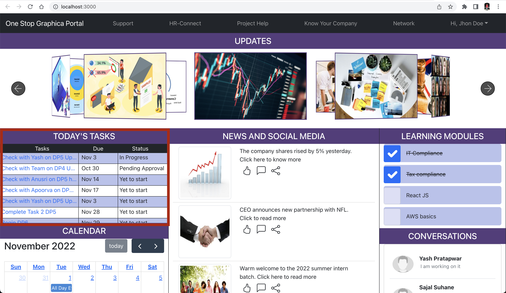
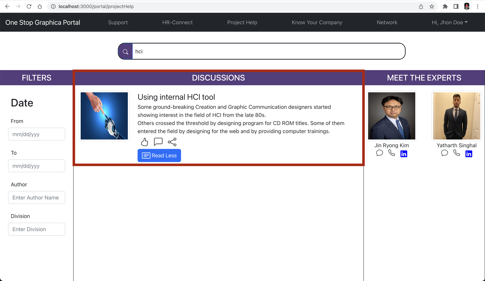
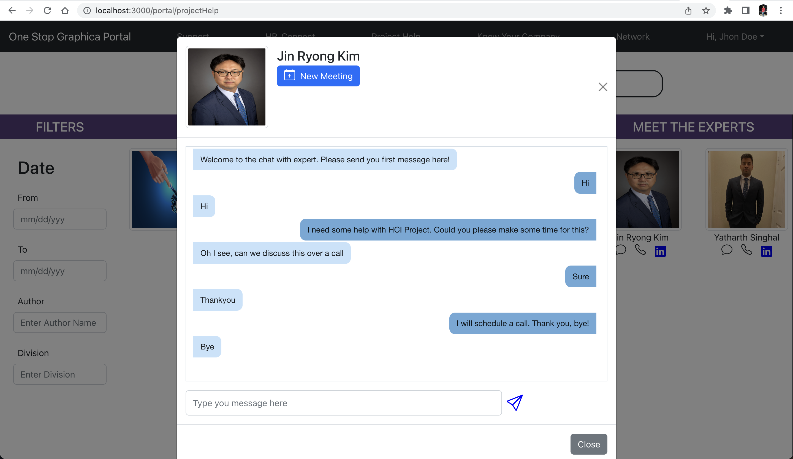

# One Stop Portal by Graphica (Your go-to solution for everything)

This project aims to solve daily life problems in the corporate world by providing them a one stop solution for everything.

View the demo Video at: https://youtu.be/59-LhhL0ekc

## Developed By
Apoorva Anil Kamat \
Yash Shyamsunder Pratapwar \
Anusri Yarlagadda\
Sajal Suhane

## Steps to run the project

0. Directly visit the deployed version of website at: https://one-stop-portal-app.vercel.app/

### Prerequisites 
* npm should be installed
* Have a code editor like VS Code

In the project directory, you can run:

1. `npm i` - To install the dependencies

2. `npm start` - To start the application in development mode

Runs the app in the development mode.\
Open [http://localhost:3000](http://localhost:3000) to view it in your browser.

The page will reload when you make changes.\

### Tasks
## Task 1: Check daily tasks
Go to http://localhost:3000 or [website](https://one-stop-portal-app.vercel.app/). On the left you can see the tasks.\
You can even click on them to visit the JIRA link to the project.

## Task 2: Check the discussions for a particular topic you are stuck on
Go to http://localhost:3000/portal/projectHelp or [website](https://one-stop-portal-app.vercel.app/portal/projectHelp). You can search for your query.\
Please go through the discussions that other users have already posted about the topic.

## Task 3: Scheduling meeting with an expert
Go to http://localhost:3000/portal/projectHelp or [website](https://one-stop-portal-app.vercel.app/portal/projectHelp). Chat with any expert you find suitable.\

If they are available, go ahead and schedule a meeting with them.

### End notes
This is demo project for representation purposes only.
Please enjoy the application!

**Made with ❤️ by Team Graphica**
